#  Seguridad en Sistemas Operativos: Control de Acceso, Auditoría y Gestión de Privilegios en una Estación de Trabajo Compartida con Ubuntu

> **Trabajo Integrador** — Arquitectura y Sistemas Operativos  
> **Tecnicatura Universitaria en Programación a Distancia — UTN**  
> **Comisión 11**

---

##  Autores

| Alumno | Comisión |
|--------|----------|
| **Acosta, Benjamín** | 11 |
| **Hernández, Gabriel** | 11 |

**Tutores:** Andrés Odiard — Comisión 11

---

## Índice

1. [Descripción del Proyecto](#-descripción-del-proyecto)
2. [Contexto](#-contexto)
3. [Stack Tecnológico](#-stack-tecnológico)
4. [Marco Teórico](#-marco-teórico)
5. [Estructura de Permisos y Directorios](#-estructura-de-permisos-y-directorios)
6. [Caso Práctico: Paso a Paso](#-caso-práctico-paso-a-paso)
7. [Resultados Obtenidos](#-resultados-obtenidos)
8. [Conclusiones](#-conclusiones)
9. [Instrucciones para Replicar](#-instrucciones-para-replicar)
10. [Bibliografía](#-bibliografía)

---

## Descripción del Proyecto

Este trabajo integrador aborda la **seguridad en sistemas operativos** desde un enfoque práctico, aplicado a un escenario real de un **laboratorio de análisis clínicos** donde múltiples técnicos comparten una misma estación de trabajo con **Ubuntu**.

El objetivo principal es implementar un esquema de seguridad que combine:
- **Aislamiento de espacios personales** (carpetas privadas por técnico)
- **Colaboración controlada** (carpeta compartida con protección contra borrados indebidos)
- **Supervisión y trazabilidad** (auditoría de accesos con `auditd`)
- **Delegación de privilegios** (backups controlados con `sudo`)
- **Protección de red** (firewall `UFW`)

---

## Contexto

**Escenario:** Un laboratorio de análisis clínicos tiene una PC con Ubuntu que usan 3 técnicos. Cada uno tiene su espacio privado. Hay una carpeta compartida para resultados de pacientes donde todos pueden escribir, pero nadie puede borrar lo de otro. El jefe del laboratorio puede leer todo y realizar backups.

**Usuarios del sistema:**
| Usuario | Rol | Permisos |
|---------|-----|----------|
| `tecnico1` | Técnico de laboratorio | Espacio privado + escritura compartida |
| `tecnico2` | Técnico de laboratorio | Espacio privado + escritura compartida |
| `tecnico3` | Técnico de laboratorio | Espacio privado + escritura compartida |
| `jefe_laboratorio` | Jefe / Supervisor | Lectura total + backups con `sudo` |

---

## Stack Tecnológico

| Tecnología | Versión / Uso |
|------------|---------------|
| **VirtualBox** | 7.x — Plataforma de virtualización |
| **Ubuntu** | 22.04/24.04 — Sistema operativo |
| **Bash** | Terminal nativa — Ejecución de comandos |
| **ext4** | Sistema de archivos |
| **auditd** | Auditoría de accesos y eventos |
| **UFW** | Firewall simplificado (interfaz de `iptables`) |
| **sudo** | Delegación de privilegios |

---

## Marco Teórico

### 1. Seguridad en Sistemas Operativos: Conceptos Fundamentales

La seguridad informática se define como la protección de la información frente a accesos no autorizados, modificaciones o destrucción. Se fundamenta en tres pilares esenciales:

- **Confidencialidad:** garantiza que solo los usuarios autorizados accedan a la información (implementada mediante permisos `700` en carpetas personales).
- **Integridad:** asegura que los datos no sean alterados indebidamente (garantizada por el **sticky bit** en directorios compartidos).
- **Disponibilidad:** el sistema debe estar operativo cuando se lo necesita.

### 2. Control de Acceso y Permisos en Linux

El modelo de permisos de Linux se basa en tres niveles: **usuario (owner)**, **grupo (group)** y **otros (others)**. Cada nivel puede tener permisos de lectura (r), escritura (w) y ejecución (x).

**Comandos clave:**
- `chmod`: modifica permisos de archivos y directorios.
- `chown`: cambia el propietario y grupo de un archivo.
- `umask`: define permisos por defecto para nuevos archivos.

El permiso `700` (`rwx------`) otorga control total al dueño y ningún acceso a grupo u otros, resultando ideal para espacios privados de usuarios.

### 3. El Sticky Bit (Permiso Especial)

El **sticky bit** es un permiso especial que, aplicado a directorios, permite que todos los usuarios puedan crear archivos, pero **únicamente el propietario de cada archivo pueda eliminarlo o renombrarlo**.

- Se representa numéricamente como `1000` (sumado al permiso base: `1777`).
- Se visualiza con la letra `t` en los permisos del directorio: `drwxrwxrwt`.
- Fundamental en entornos colaborativos como `/tmp` o, en este caso, `/lab/resultados`.

### 4. Gestión de Usuarios y Grupos

- **Usuarios:** identidad individual en el sistema, con UID único.
- **Grupos:** permiten administrar permisos de forma masiva.
- **Principio de mínimo privilegio:** cada usuario solo debe tener los permisos estrictamente necesarios para su función.

El comando `usermod -aG` permite agregar usuarios a grupos secundarios, facilitando la asignación de permisos de lectura para supervisores sin otorgar privilegios de escritura.

### 5. Auditoría de Sistemas con `auditd`

El servicio `auditd` es el demonio de auditoría de Linux que registra eventos del sistema en tiempo real. Permite:

- Monitorear accesos a archivos y directorios específicos.
- Registrar cambios de permisos y atributos.
- Detectar accesos no autorizados o actividades sospechosas.
- Generar trazabilidad completa para análisis forense.

Las reglas se configuran con `auditctl` y se consultan con `ausearch`, permitiendo filtrar por claves personalizadas.

### 6. Delegación de Privilegios con `sudo`

El comando `sudo` permite ejecutar comandos con privilegios de superusuario sin iniciar sesión como root. Se configura en `/etc/sudoers` (editado con `visudo`).

**Ventajas:**
- No requiere compartir la contraseña de root.
- Permite registrar qué usuario ejecutó qué comando con privilegios elevados.
- Facilita la delegación granular de privilegios (comandos específicos para usuarios específicos).
- Reduce el riesgo de escalamiento de privilegios no autorizado.

### 7. Firewall con UFW

**UFW** (Uncomplicated Firewall) es una interfaz simplificada para `iptables` que permite configurar reglas de firewall de manera sencilla.

**Políticas recomendadas:**
- `deny incoming`: bloquear todo tráfico entrante no solicitado.
- `allow outgoing`: permitir tráfico saliente.
- `allow ssh`: habilitar acceso remoto seguro únicamente por el puerto 22.

Esta configuración reduce significativamente la superficie de ataque del sistema.

### 8. Vulnerabilidades y Amenazas Relacionadas

El escenario del laboratorio está expuesto a diversas amenazas:

- **Acceso no autorizado:** un técnico intenta leer resultados de otro (mitigado con permisos `700`).
- **Eliminación accidental o maliciosa:** mitigada con el sticky bit en directorios compartidos.
- **Escalamiento de privilegios:** mitigado con `sudo` controlado y principio de mínimo privilegio.
- **Falta de trazabilidad:** mitigada con `auditd` registrando todos los accesos.
- **Accesos remotos no autorizados:** mitigados con UFW bloqueando tráfico entrante.

---

## Estructura de Permisos y Directorios

```
/
├── lab/
│   └── resultados/          ← drwxrwxrwt (1777) — Sticky bit activo
│       ├── paciente_Ana_Garcia.txt      (tecnico1)
│       ├── paciente_Luis_Rodriguez.txt  (tecnico2)
│       └── paciente_Maria_Lopez.txt     (tecnico3)
│
└── home/
    ├── tecnico1/
    │   └── personal/        ← drwxr-x--- (750) — Solo dueño + jefe (lectura)
    ├── tecnico2/
    │   └── personal/        ← drwxr-x--- (750)
    ├── tecnico3/
    │   └── personal/        ← drwxr-x--- (750)
    └── jefe_laboratorio/
        └── (home del jefe)
```

**Resumen de permisos:**

| Directorio | Permisos | Dueño | Grupo | Otros | Propósito |
|------------|----------|-------|-------|-------|-----------|
| `/home/tecnicoX/personal` | `drwxr-x---` (750) | `tecnicoX` | `tecnicoX` | — | Espacio privado del técnico |
| `/lab/resultados` | `drwxrwxrwt` (1777) | `root` | `root` | `rwx` | Carpeta compartida con sticky bit |

---

## Caso Práctico: Paso a Paso

### Paso 1: Instalación de `auditd`

Se instala el servicio de auditoría necesario para el monitoreo de accesos:

```bash
sudo apt install auditd
```

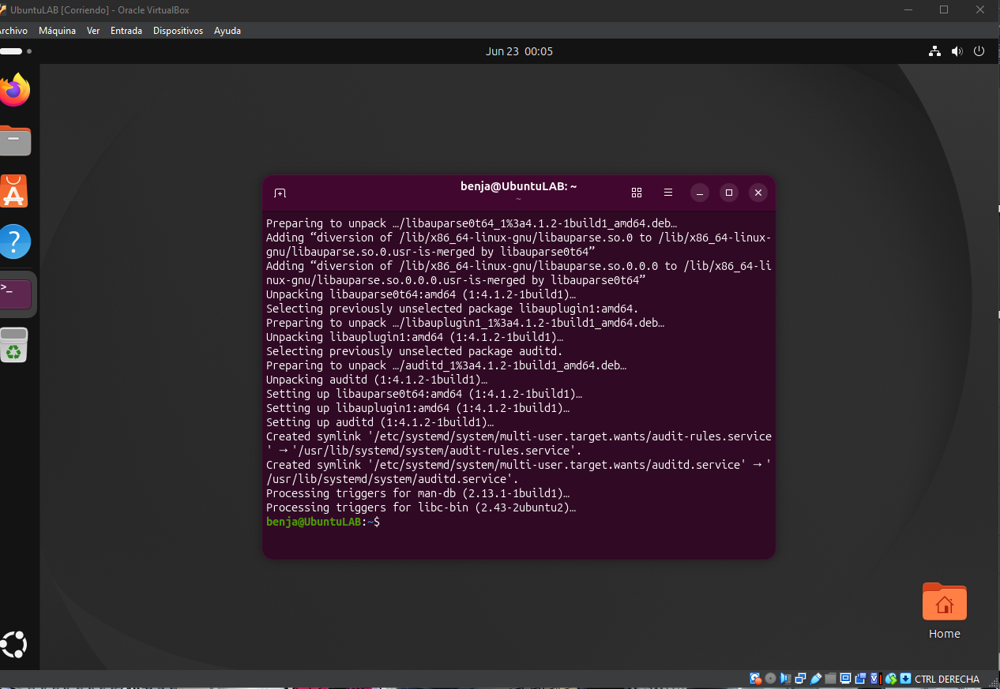

---

### Paso 2: Creación de Usuarios

Se crean los cuatro usuarios del sistema: tres técnicos y el jefe de laboratorio.

```bash
sudo adduser tecnico1
sudo adduser tecnico2
sudo adduser tecnico3
sudo adduser jefe_laboratorio
```

Verificación de usuarios creados:

```bash
cat /etc/passwd | grep -E "tecnico|jefe"
```

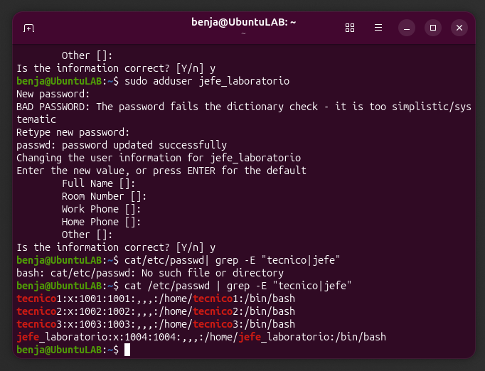

---

### Paso 3: Creación de la Estructura de Directorios

```bash
sudo mkdir -p /lab/resultados
sudo mkdir -p /home/tecnico1/personal
sudo mkdir -p /home/tecnico2/personal
sudo mkdir -p /home/tecnico3/personal
```

Verificación:

```bash
ls -la /lab/
sudo ls -la /home/tecnico1/
```

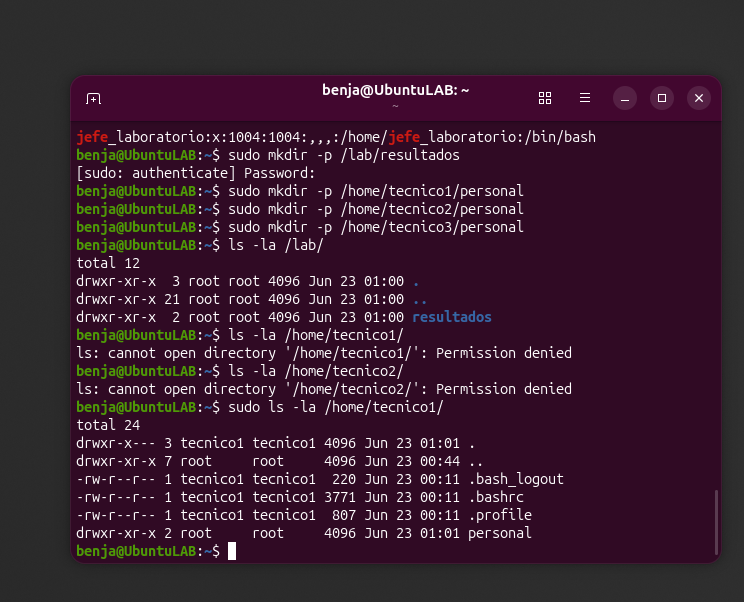

---

### Paso 4: Configuración de Permisos Personales (700)

Se asignan permisos `700` a las carpetas personales, garantizando que solo el dueño tenga acceso:

```bash
sudo chown tecnico1:tecnico1 /home/tecnico1/personal && sudo chmod 700 /home/tecnico1/personal
sudo chown tecnico2:tecnico2 /home/tecnico2/personal && sudo chmod 700 /home/tecnico2/personal
sudo chown tecnico3:tecnico3 /home/tecnico3/personal && sudo chmod 700 /home/tecnico3/personal
```

Verificación:

```bash
sudo ls -ld /home/tecnico1/personal
sudo ls -ld /home/tecnico2/personal
sudo ls -ld /home/tecnico3/personal
```

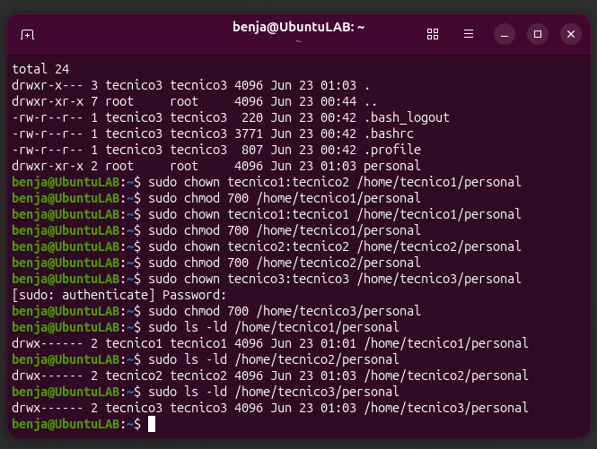

---

### Paso 5: Prueba de Aislamiento

Se verifica que un técnico no pueda acceder a la carpeta personal de otro:

```bash
sudo -u tecnico2 ls /home/tecnico1/personal
```

**Resultado esperado:** `Permission denied`

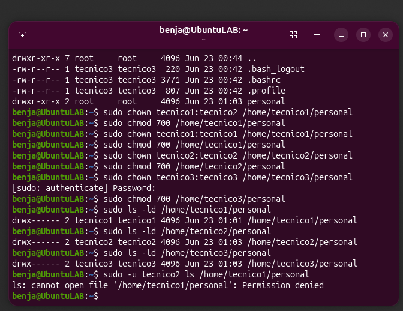

---

### Paso 6: Configuración del Sticky Bit en Carpeta Compartida

```bash
sudo chown root:root /lab/resultados
sudo chmod 1777 /lab/resultados
```

Verificación del sticky bit:

```bash
ls -ld /lab/resultados
```

**Resultado esperado:** `drwxrwxrwt`

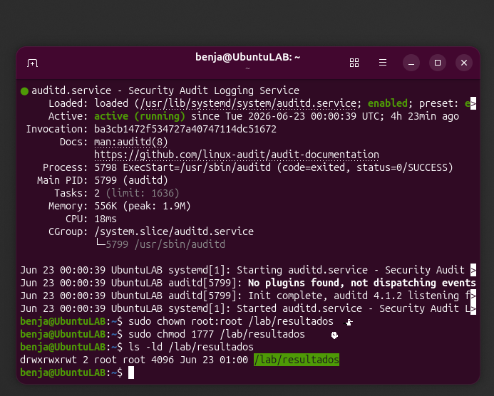

---

### Paso 7: Creación de Archivos en Carpeta Compartida

Cada técnico crea un archivo de resultados de paciente:

```bash
sudo -u tecnico1 touch /lab/resultados/paciente_Ana_Garcia.txt
sudo -u tecnico2 touch /lab/resultados/paciente_Luis_Rodriguez.txt
sudo -u tecnico3 touch /lab/resultados/paciente_Maria_Lopez.txt
```

Verificación:

```bash
ls -la /lab/resultados/
```

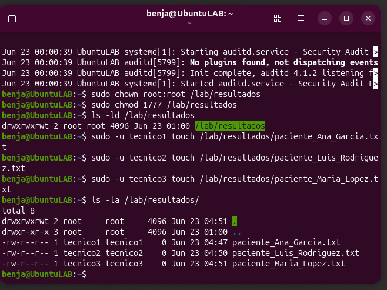

---

### Paso 8: Prueba del Sticky Bit

Se intenta borrar un archivo de otro usuario (debe fallar):

```bash
sudo -u tecnico2 rm /lab/resultados/paciente_Ana_Garcia.txt
# Responder 'n'
sudo -u tecnico2 rm -f /lab/resultados/paciente_Ana_Garcia.txt
```

**Resultado esperado:** `Operation not permitted`

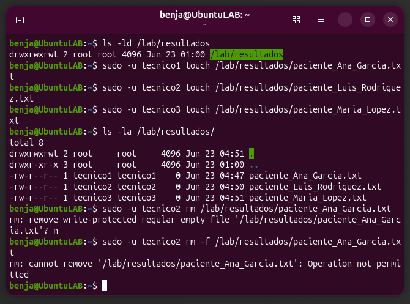

Verificación de que el archivo sobrevive:

```bash
ls -la /lab/resultados/
```

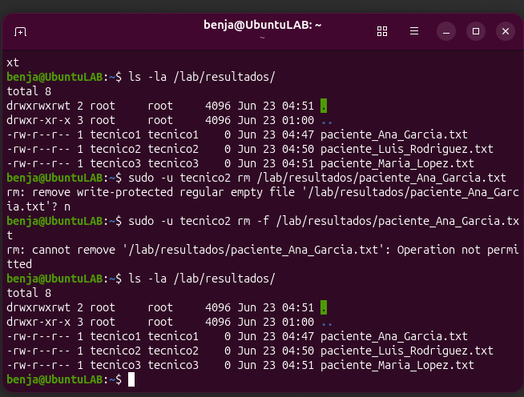

---

### Paso 9: Configuración de `sudo` para el Jefe

Se edita el archivo `sudoers` para permitir al jefe realizar backups sin conocer la contraseña de root:

```bash
sudo visudo
```

Línea agregada al final del archivo:

```
jefe_laboratorio ALL=(ALL) NOPASSWD: /bin/tar, /bin/cp, /usr/bin/rsync
```

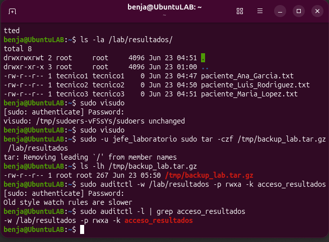

---

### Paso 10: Prueba de Backup por el Jefe

El jefe realiza un backup de la carpeta compartida:

```bash
sudo -u jefe_laboratorio sudo tar -czf /tmp/backup_lab.tar.gz /lab/resultados
```

Verificación:

```bash
ls -lh /tmp/backup_lab.tar.gz
```

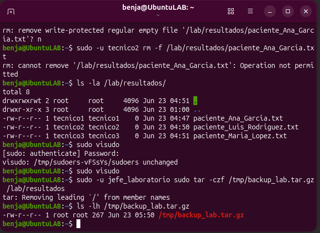

---

### Paso 11: Configuración de Auditoría con `auditd`

Verificación de que el servicio está activo:

```bash
sudo systemctl status auditd
```

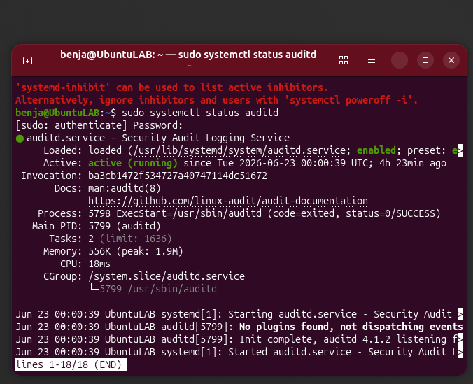

Se agrega la regla de auditoría para vigilar `/lab/resultados`:

```bash
sudo auditctl -w /lab/resultados -p rwxa -k acceso_resultados
```

Verificación de la regla cargada:

```bash
sudo auditctl -l | grep acceso_resultados
```

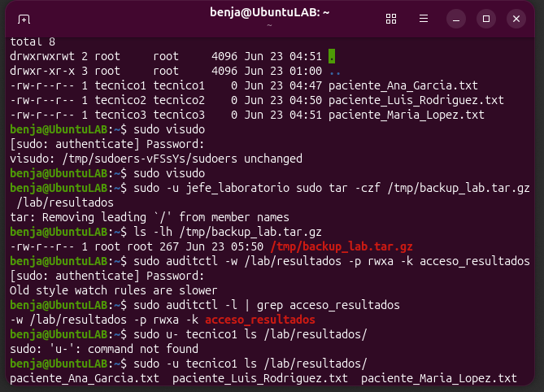

---

### Paso 12: Generación de Actividad y Consulta de Logs

Se genera actividad en la carpeta auditada:

```bash
sudo -u tecnico1 ls /lab/resultados/
```

Consulta de los logs de auditoría:

```bash
sudo ausearch -k acceso_resultados
```

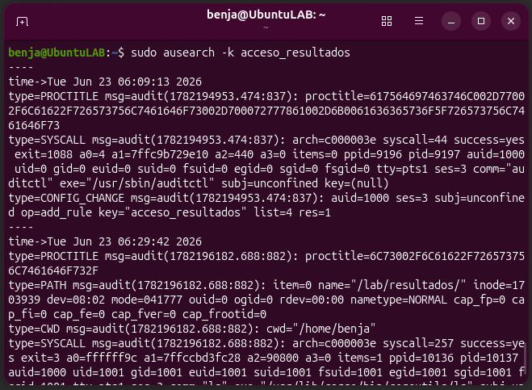

---

### Paso 13: Vista General con `tree`

```bash
sudo apt install tree
tree /lab/ /home/tecnico1/ /home/tecnico2/ /home/tecnico3/
```

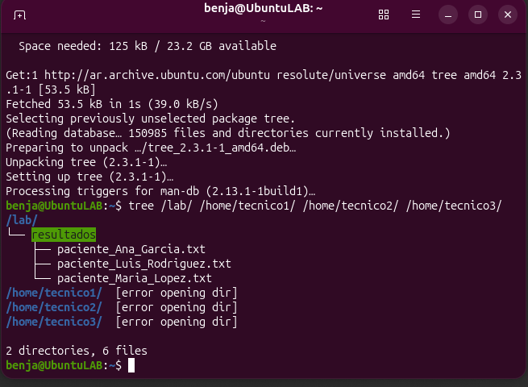

---

### Paso 14: Acceso del Jefe a Todas las Carpetas

Se agrega al jefe a los grupos de los técnicos y se ajustan permisos para lectura:

```bash
sudo usermod -aG tecnico1 jefe_laboratorio
sudo usermod -aG tecnico2 jefe_laboratorio
sudo usermod -aG tecnico3 jefe_laboratorio

sudo chmod 750 /home/tecnico1/personal
sudo chmod 750 /home/tecnico2/personal
sudo chmod 750 /home/tecnico3/personal
```

Verificación de acceso del jefe:

```bash
sudo -u jefe_laboratorio ls -la /home/tecnico1/personal/
sudo -u jefe_laboratorio ls -la /home/tecnico2/personal/
sudo -u jefe_laboratorio ls -la /home/tecnico3/personal/
sudo -u jefe_laboratorio ls -la /lab/resultados/
```

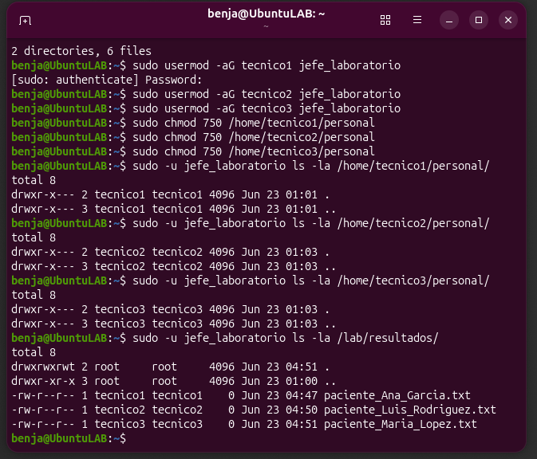

---

### Paso 15: Configuración del Firewall UFW

```bash
sudo apt install ufw
sudo ufw default deny incoming
sudo ufw default allow outgoing
sudo ufw allow ssh
sudo ufw enable
```

Verificación:

```bash
sudo ufw status verbose
```

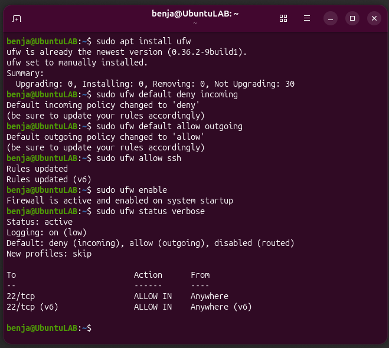

---

## Resultados Obtenidos

### 5.1. Control de acceso y aislamiento
- Los permisos `700` en carpetas personales funcionaron correctamente, impidiendo que usuarios no autorizados accedan a espacios ajenos.
- La prueba con `sudo -u tecnico2 ls /home/tecnico1/personal` arrojó **Permission denied**, confirmando el aislamiento.

### 5.2. Colaboración controlada con sticky bit
- El sticky bit en `/lab/resultados` (permisos `1777`) permitió que todos los técnicos crearan archivos.
- El intento de borrado de un archivo ajeno por parte de `tecnico2` fue bloqueado con **Operation not permitted**.
- El archivo `paciente_Ana_Garcia.txt` permaneció intacto tras el intento de eliminación.

### 5.3. Delegación de privilegios
- La configuración de `sudo` permitió que `jefe_laboratorio` ejecute `tar`, `cp` y `rsync` sin contraseña de root.
- El backup `/tmp/backup_lab.tar.gz` se generó exitosamente.

### 5.4. Auditoría de accesos
- El servicio `auditd` registró correctamente los accesos a `/lab/resultados`.
- El comando `ausearch -k acceso_resultados` mostró entradas con **UID**, comando, ruta y timestamp.

### 5.5. Acceso del supervisor
- `jefe_laboratorio` pudo leer todas las carpetas personales y la compartida tras ser agregado a los grupos correspondientes y ajustar permisos a `750`.

### 5.6. Protección de red
- UFW se activó con política **deny incoming**, bloqueando todo tráfico entrante no solicitado.
- El puerto **22 (SSH)** permanece abierto para administración remota.

### 5.7. Dificultades y soluciones
- Inicialmente se intentó usar `chmod 700` para las carpetas personales, lo que impedía el acceso del jefe. Se resolvió cambiando a `750` y agregando al jefe a los grupos de los técnicos.
- El comando `cat/etc/passwd` (sin espacio) generó un error. Se corrigió usando `cat /etc/passwd`.
- `auditctl` mostró la advertencia *Old style watch rules are slower*, la cual es informativa y no afecta el funcionamiento.

---

## Conclusiones

El desarrollo de este trabajo permitió comprender que la **seguridad en sistemas operativos** no depende únicamente de herramientas externas, sino de una correcta configuración de los **mecanismos nativos del sistema**. La implementación del **sticky bit** demostró ser una solución elegante para entornos colaborativos donde se requiere escritura compartida sin riesgo de eliminación indebida.

La **auditoría con `auditd`** resultó fundamental para establecer trazabilidad, un requisito crítico en entornos donde se manejan datos sensibles como resultados médicos. La capacidad de registrar quién accedió, cuándo y qué hizo proporciona una capa adicional de seguridad y cumplimiento normativo.

La configuración de `sudo` con privilegios específicos (`tar`, `cp`, `rsync`) en lugar de acceso total de root demuestra la aplicación del **principio de mínimo privilegio**, reduciendo el riesgo de escalamiento no autorizado.

El firewall **UFW**, aunque en un entorno local puede parecer secundario, representa una capa esencial de **defensa en profundidad**. Su configuración restrictiva por defecto con excepciones controladas (SSH) es una práctica recomendada en cualquier sistema conectado a red.

Como futuro técnico en programación, esta experiencia evidencia la importancia de diseñar aplicaciones que respeten los permisos del sistema operativo subyacente y consideren la seguridad desde las primeras etapas del desarrollo.

### Posibles mejoras futuras
- Implementación de **cifrado** en las carpetas personales mediante **LUKS** para protección de datos en reposo.
- Configuración de **autenticación multifactor (MFA)** para acceso al sistema.
- Implementación de un sistema de **detección de intrusiones (IDS)** como Snort o Suricata.
- Configuración de **backups automatizados** mediante `cron`.
- Uso de **SELinux** o **AppArmor** para control de acceso obligatorio a nivel de procesos.

---

## Instrucciones para Replicar

### Requisitos previos
- VirtualBox 7.x (o cualquier hipervisor)
- Imagen ISO de Ubuntu Server/Desktop 22.04 o 24.04
- Mínimo 2 GB de RAM asignados a la VM
- Conexión a Internet para descargar paquetes

### Pasos de replicación

1. **Crear la VM** en VirtualBox con Ubuntu instalado.
2. **Actualizar el sistema:**
   ```bash
   sudo apt update && sudo apt upgrade -y
   ```
3. **Seguir el [Caso Práctico paso a paso](#-caso-práctico-paso-a-paso)** desde el Paso 1.
4. **Verificar cada resultado** con los comandos de validación indicados.
5. **Documentar** con capturas de pantalla para evidencia.

> ⚠️ **Nota:** Las reglas de `auditctl` se pierden al reiniciar. Para hacerlas permanentes, agregarlas al archivo `/etc/audit/rules.d/audit.rules`.

---

## Bibliografía

- Materiales de cátedra: Arquitectura y Sistemas Operativos, UTN Tecnicatura Universitaria en Programación a Distancia. (2025). *Introducción a la seguridad en sistemas operativos* [Apuntes de clase].
- Materiales de cátedra: Arquitectura y Sistemas Operativos, UTN Tecnicatura Universitaria en Programación a Distancia. (2025). *Seguridad avanzada y mantenimiento preventivo* [Apuntes de clase].
- Materiales de cátedra: Arquitectura y Sistemas Operativos, UTN Tecnicatura Universitaria en Programación a Distancia. (2025). *Herramientas básicas de seguridad: firewall, antivirus y monitoreo* [Apuntes de clase].
- Materiales de cátedra: Arquitectura y Sistemas Operativos, UTN Tecnicatura Universitaria en Programación a Distancia. (2025). *Trabajo Práctico – Seguridad en Sistemas Operativos* [Modelo de referencia].
- Materiales de cátedra: Arquitectura y Sistemas Operativos, UTN Tecnicatura Universitaria en Programación a Distancia. (2025). *Qué es Nmap y cómo utilizarlo* [Apuntes de clase].
- Roco, D. (2020). *Principales vulnerabilidades y ataques más importantes a componentes de las TIC*. Universidad Tecnológica Nacional, Facultad Regional Mendoza.
- Silberschatz, A., Galvin, P. B., & Gagne, G. (2018). *Operating System Concepts* (10th ed.). John Wiley & Sons.
- Ubuntu Server Guide. (s.f.). *Security*. https://ubuntu.com/server/docs/security
- Linux Audit Documentation. (s.f.). https://github.com/linux-audit/audit-documentation
- UFW - Uncomplicated Firewall. (s.f.). https://help.ubuntu.com/community/UFW

---

## Licencia

Este proyecto fue desarrollado con fines académicos para la materia **Arquitectura y Sistemas Operativos** de la **UTN — Tecnicatura Universitaria en Programación a Distancia**.

---

> *"La seguridad no es un producto, es un proceso."* — Bruce Schneier
